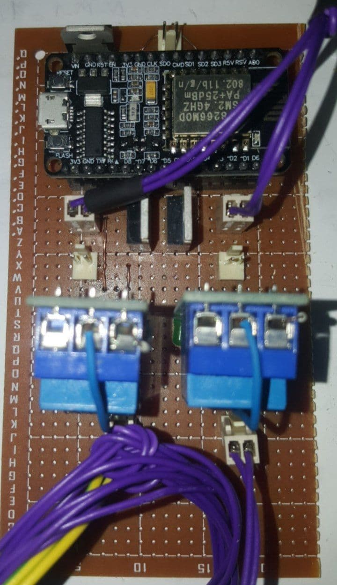

# IOT Plant  
This snippet of code lets NodeMCU V3 be able to satisfy the needs of a Plant to its full extend. A sensor is connected to the device to measure the humidity and temperature of the soil beneath the Plant. By comparing the received data to a threshold, that is set according to the Plant's habitat, the NodeMCU tries to figure out what the Plant needs. Also the circuit can be controled remotely through the internet, which is very cool. 🤩

## Images
Image 1  
  
Image 2  
  
